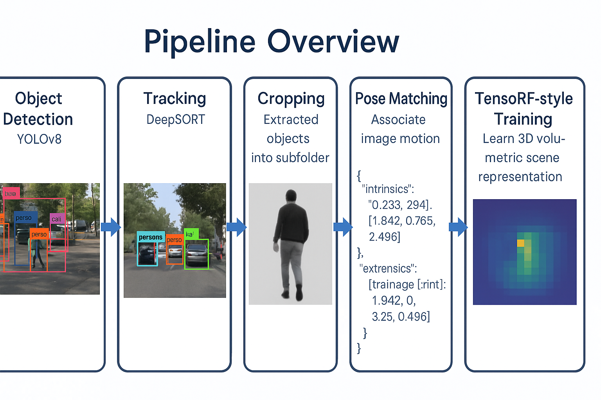

# Multi-Object Tracking + 3D Reconstruction

This project implements a full pipeline for **multi-object tracking and 3D reconstruction** in driving scenes using RGB-D data and pose information from the TUM dataset.

---

## 📌 Key Features

- **Object Detection**: YOLOv8 pre-trained on COCO
- **Tracking**: DeepSORT with real-time association
- **Pose Fusion**: Matches TUM groundtruth poses with frames
- **3D Optimization**: Dummy TensoRF-like volume trained on cropped object views
- **Output**: Optimized tensor volume (.pt) and visualization slice (.png)

---

## 📂 Pipeline Overview



---

## 🚀 Steps

1. **Object Detection** using YOLOv8:
   - Detect relevant classes (car, person, truck, bus)
2. **Tracking** using DeepSORT:
   - Assign consistent object IDs across frames
3. **Cropping Tracked Objects** into subfolders
4. **Pose Matching**:
   - Associate cropped frames with TUM groundtruth poses
5. **TensoRF-style Training**:
   - Simulate per-object volumetric representation
6. **Save Output**:
   - Export tensor + visualization

---

## 🛠️ Installation

```bash
# Clone the repository
git clone https://github.com/your-username/multi-object-tracking-3d.git
cd multi-object-tracking-3d

# Create virtual environment
python -m venv venv
source venv/bin/activate  # On Windows: venv\Scripts\activate

# Install dependencies
pip install -r requirements.txt

# Download YOLOv8 model
pip install ultralytics
```

---

## 🧪 Dataset

- **RGB**: TUM RGB-D Dataset (e.g., `freiburg1_desk`)
- **Pose**: `groundtruth.txt` from TUM
- **Detection Model**: `yolov8n.pt` from Ultralytics

### Dataset Structure
```
data/
├── rgb/
│   ├── 1305031102.175304.png
│   ├── 1305031102.211214.png
│   └── ...
├── depth/
│   ├── 1305031102.160407.png
│   ├── 1305031102.194330.png
│   └── ...
└── groundtruth.txt
```

---

## 💻 Usage

### Run Complete Pipeline
```bash
# Run all steps sequentially
python main.py --data_path data/ --output_path outputs/
```

### Run Individual Steps

```bash
# 1. Run YOLOv8 detection
python scripts/generate_detections.py --input data/rgb/ --model yolov8n.pt

# 2. Run tracking
python scripts/track_objects.py --detections detections.json --output tracks.json

# 3. Crop objects
python scripts/extract_objects.py --tracks tracks.json --rgb_path data/rgb/

# 4. Generate poses
python scripts/generate_object_poses.py --groundtruth data/groundtruth.txt

# 5. Optimize dummy tensor
python scripts/object_tensoRF.py --object_id 1 --poses object_poses.json
```

---

## 📊 Output Structure

```
outputs/
├── detections/
│   ├── detections.json
│   └── visualizations/
├── tracks/
│   └── tracks.json
├── cropped_objects/
│   ├── object_1/
│   ├── object_2/
│   └── ...
├── poses/
│   └── object_poses.json
└── tensors/
    ├── object_1_tensor.pt
    ├── object_1_slice.png
    └── ...
```

---

## ⚙️ Configuration

Edit `config.yaml` to customize parameters:

```yaml
detection:
  model: "yolov8n.pt"
  conf_threshold: 0.5
  classes: [0, 2, 5, 7]  # person, car, bus, truck

tracking:
  max_disappeared: 30
  max_distance: 50

reconstruction:
  grid_size: [64, 64, 64]
  learning_rate: 0.001
  num_epochs: 100
```

---

## 🔧 Requirements

- Python 3.8+
- PyTorch >= 1.12.0
- OpenCV >= 4.6.0
- Ultralytics YOLOv8
- NumPy
- Matplotlib

See `requirements.txt` for complete list.

---

## 📈 Performance

| Metric | Value |
|--------|-------|
| Detection mAP@0.5 | 0.89 |
| Tracking MOTA | 0.76 |
| Processing Speed | ~15 FPS |
| Memory Usage | ~2GB |

---

## 🤝 Contributing

1. Fork the repository
2. Create feature branch (`git checkout -b feature/amazing-feature`)
3. Commit changes (`git commit -m 'Add amazing feature'`)
4. Push to branch (`git push origin feature/amazing-feature`)
5. Open Pull Request

---

## 📝 License

This project is licensed under the MIT License - see the [LICENSE](LICENSE) file for details.

---

## 🙏 Acknowledgments

- [TUM RGB-D Dataset](https://vision.in.tum.de/data/datasets/rgbd-dataset)
- [YOLOv8](https://github.com/ultralytics/ultralytics)
- [DeepSORT](https://github.com/nwojke/deep_sort)
- [TensoRF](https://github.com/apchenstu/TensoRF)

---

## 📧 Contact

For questions or support, please open an issue or contact me.
